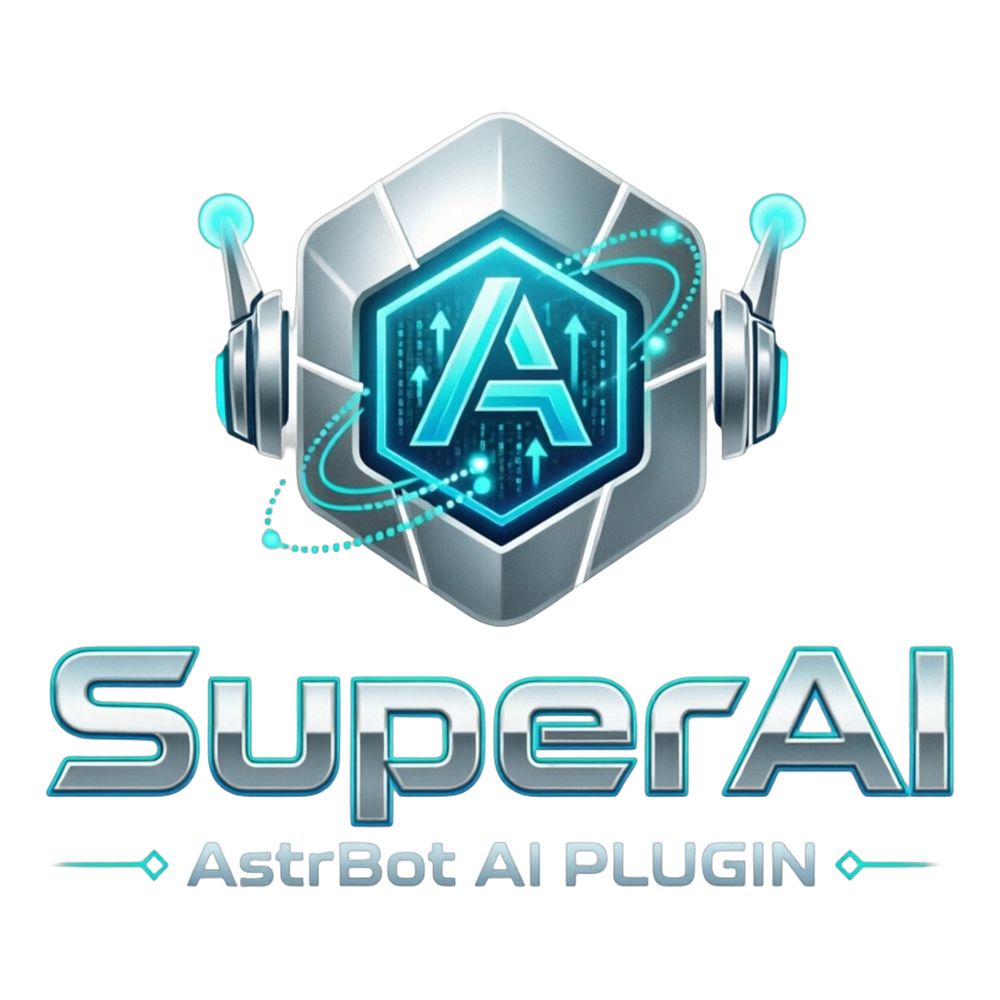

<div align="center">



# SuperAI

**新一代 AstrBot AI 增强插件**

多模型智能路由 · 滚动摘要与长期记忆 · Agent 工具 · 知识库增强 · 用量成本控制

[](https://github.com/AstrBotDevs/AstrBot)
[](./LICENSE)
[](./metadata.yaml)

</div>

---

## 这是什么

AstrBot 本身已经很好用，但当你真正把它跑在群里，很快就会遇到这几类问题：

- 一个 Bot 配了好几个模型，却永远只用「当前使用」的那一个 —— 问候语也走最贵的模型；
- 主模型一旦超时 / 限流，整轮对话直接失败，用户只看到一片沉默；
- 聊了几十轮之后，上下文越堆越长，token 成本飙升，早期信息还被挤掉了；
- 模型不知道「上周你说过你喜欢简洁的回答」；
- 想知道这个月烧了多少 token，只能去服务商后台翻。

**SuperAI 就是为这些问题写的一层增强中间件。** 它挂在 AstrBot 的 `on_llm_request` /
`on_llm_response` 钩子上，不改变 AstrBot 原有流程，只在你需要的地方做加法。

## 核心能力

### 1. SuperRouter —— 多模型智能路由

按「任务类型 + 消息内容 + 上下文长度 + 会话偏好」自动把请求分配到最合适的模型：

| 档位 | 适用场景 | 典型配置 |
| --- | --- | --- |
| `cheap` | 闲聊、问候、翻译、改写 | 便宜的小模型 |
| `strong` | 写作、总结、代码、方案 | 主力质量模型 |
| `reasoning` | 数学、逻辑、排错、推导 | 推理模型 |
| `vision` | 带图片的请求 | 多模态模型 |
| `long_context` | 超长上下文 | 长窗口模型 |

四种策略：`rule`（关键词规则，可自定义映射）、`auto`（按长度与内容启发式判断）、
`cheap_first`（省钱优先）、`quality_first`（质量优先）。

**失败自动降级**：主模型失败时按降级链依次重试，并对连续失败的 provider 做健康度排序，
把不稳定模型自动排到后面，保证回复不中断。

### 2. SuperMemory —— 滚动摘要 + 长期记忆

- **滚动摘要**：对话累积超过阈值后，自动用「便宜档」模型把历史压缩成一段摘要，
  用摘要替换冗长历史，显著降低 token 消耗，同时保留关键结论。
- **长期记忆**：自动从对话中抽取稳定偏好与客观事实（如「用户在做 AstrBot 插件」），
  按相关性在后续对话中注入；长时间未命中的记忆按半衰期衰减并清理。
- **模型可主动记忆**：提供 `superai_remember` / `superai_recall` 工具，
  让模型自己决定何时记、何时查（用户说「记住……」即可）。

> 遵循 AstrBot 官方建议：**稳定**内容（角色设定）写入 `system_prompt`，
> **动态**内容（时间、本轮记忆、摘要）走 `extra_user_content_parts`，避免破坏提示词缓存。

### 3. SuperAgent —— 工具增强

注册为 AstrBot 的 function calling 工具，模型按需调用：

| 工具 | 作用 |
| --- | --- |
| `superai_web_search` | 联网搜索（DuckDuckGo 免 Key / 自建 SearXNG） |
| `superai_fetch_url` | 抓取网页正文 |
| `superai_knowledge_search` | 检索 AstrBot 知识库 |
| `superai_remember` / `superai_recall` | 写入 / 检索长期记忆 |
| `superai_history_summary` | 读取本会话的历史对话摘要 |
| `superai_run_workflow` | 触发预编排的多步工作流 |

### 4. 工作流编排

把多步 AI 任务写进配置，非技术用户也能用：

```json
{
  "早报": {
    "description": "每日科技早报",
    "route": "cheap",
    "steps": [
      { "name": "收集", "prompt": "用三句话总结今天的科技新闻" },
      { "name": "翻译", "prompt": "把下面内容翻译成英文：\n{{prev}}" }
    ]
  }
}
```

支持 `{{prev}}`（上一步输出）、`{{input}}`（用户输入）、`{{step}}`（当前步号）占位符。

### 5. 用量统计与成本控制

- 记录每次请求的 token / 耗时 / 路由档位，按天聚合落盘；
- 可设置**每日 token 上限**与**请求数上限**，超限自动拦截并提示；
- `/superai stats` 指令与 **Studio 面板** 可视化查看。

## 安装

1. 在 AstrBot WebUI 的「插件市场」搜索 `SuperAI` 安装，或手动克隆到 `data/plugins/`：

   ```bash
   cd AstrBot/data/plugins
   git clone https://cnb.cool/asoe/TechSauce/astrbot-plugin-SuperAI.git astrbot_plugin_superai
   ```

2. 重启 AstrBot，或在插件页点击「重载插件」；
3. 进入插件配置，为各路由档位选择模型（至少配置一个）。

> **依赖**：插件仅依赖 `aiohttp`，AstrBot 已内置，无需额外安装；如在无 AstrBot 的环境中运行测试，请先 `pip install -r requirements.txt -r requirements-dev.txt`。
> **版本要求**：AstrBot >= 4.5.7（使用了 `llm_generate` / `tool_loop_agent` 等新 SDK）。

## 快速上手

配置好之后，在群里直接用：

```
/ai 帮我写一段关于云原生构建的推文
```

SuperAI 会自动：判断档位 → 选模型 → 拉取相关记忆 → 带上工具 → 生成回复。

常用指令：

| 指令 | 说明 |
| --- | --- |
| `/ai <问题>` | 向 SuperAI 提问（自动路由 + 记忆 + 工具），支持附带图片 |
| `/superai status` | 查看运行状态与今日用量 |
| `/superai stats [天数]` | 查看用量统计 |
| `/superai memory list [条数]` | 查看本会话记忆与当前摘要 |
| `/superai memory search <关键词>` | 检索记忆 |
| `/superai memory clear` | 清空本会话记忆（仅管理员） |
| `/superai memory stats` | 查看全局记忆概览（会话数 / 各类型条数） |
| `/superai route` | 查看路由档位、模型映射与当前降级链 |
| `/superai route strong` | 把本会话固定到 `strong` 档位（`auto` 恢复） |
| `/superai tools` | 查看已注册工具及用途 |
| `/superai workflow [名称] [输入]` | 查看或运行工作流 |
| `/superai maintain` | 立即落盘统计并衰减记忆（仅管理员） |
| `/superai help` | 帮助 |

## 配置说明

配置项在 WebUI 插件配置页可视化编辑，主要分组：

- **基础**：总开关、启用的任务类型、调试日志
- **模型路由**：策略、各档位模型、长上下文阈值、自定义关键词映射、重试次数
- **记忆与摘要**：摘要触发轮数、摘要专用模型、长期记忆条数与注入开关、衰减半衰期
- **联网搜索**：引擎（DuckDuckGo / SearXNG）、结果条数、超时
- **知识库**：默认知识库、检索条数
- **Agent**：最大步数、工具超时、附加系统提示词
- **指令行为**：群白名单 / 黑名单、冷却时间、输入长度上限
- **用量统计**：每日 token / 请求数上限、保留天数
- **工作流**：工作流定义

## Studio 面板

插件在 WebUI 中提供一个 **SuperAI Studio** 页面（`pages/studio/`），可以：

- 查看各能力开关、可用模型、路由档位映射、模型健康度；
- 查看近 7 天的请求数 / token / 平均耗时，以及模型与路由分布；
- 查看已注册工具；
- 按会话 UMO 检索或清空记忆。

## 架构

```
main.py                  # 插件入口：插件类、@filter 钩子、指令、Web API
                         #   —— 必须放这里，见下面「入口为什么必须在根目录」
superai/
├── agent_runner.py      # 带降级/超时重试的 Agent 执行器
├── prompt.py            # 提示词构建（稳定/动态分离）
├── memory_service.py    # 摘要生成与事实抽取
├── core/
│   ├── config.py        # 配置视图与默认值
│   ├── metrics.py       # 用量统计与预算
│   ├── utils.py         # 文本 / token 估算 / 重试
│   └── errors.py        # 统一异常
├── router/router.py     # SuperRouter 路由与降级
├── storage/             # JSON 持久化（记忆 / 摘要 / 工作流）
├── tools/               # function calling 工具集
└── main.py              # 兼容垫片（旧导入路径 re-export 根 main.py）
```

数据落在 `data/plugin_data/astrbot_plugin_superai/`（遵循官方「持久化数据放 data 目录」原则）。

### 入口为什么必须在根目录

AstrBot 的 `PluginManager` 有两条会让插件**静默失效**的硬约束，实现时都踩过：

1. **只认 `main.py` 或「与目录同名的 `<dirname>.py`」**。入口放在子目录
   （如 `superai/main.py`）时，日志只留一行
   `Plugin astrbot_plugin_superai has neither main.py nor astrbot_plugin_superai.py; skipping it.`，
   插件被跳过 —— 表面「装上了」，实际一个钩子都没注册。
2. **插件类与 `@filter` 钩子必须定义在入口模块里**。框架用
   `metadata.module_path`（入口模块路径）调
   `get_handlers_by_module_name()` 找处理器，命中后才执行
   `handler.handler = functools.partial(raw_handler, metadata.star_cls)`
   来绑定 `self`。而处理器的 `handler_module_path` 记录的是**装饰器所在模块**。
   若插件类定义在子模块、入口只是转口，两者永不相等 → 绑定不发生 →
   调用时抛 `TypeError: SuperAIPlugin.on_llm_request() missing 1 required
   positional argument: 'req'`，且异常被 `call_event_hook()` 吞掉只记一行 error，
   于是**路由 / 记忆注入 / 图片保护 / 预算拦截全部静默失效**。

所以：**插件类与钩子放根 `main.py`**，`superai/` 包只放不依赖插件实例的纯逻辑。
`tests/test_plugin_loader_contract.py` 把这组不变量用测试固定住；
`scripts/e2e_smoke.py` 在真实 AstrBot 上按框架的方式加载与调用钩子，
专门守住「测试绿、线上死」这类陷阱（已接入 CI）。

## 开发

```bash
# 运行依赖（AstrBot 已内置 aiohttp；单独跑测试时需自行安装）
pip install -r requirements.txt
# 开发 / CI 依赖（ruff + pytest 等）
pip install -r requirements-dev.txt

# 代码风格
ruff check .
ruff format --check .

# 单元测试
python -m pytest tests
```

`tests/stubs/astrbot/` 是一个最小的 AstrBot 替身，让纯逻辑模块（路由、配置、存储、
统计、工具装配）在没有 AstrBot 的环境下也能被测试。

若能提供真实的 AstrBot 源码路径（默认探测 `/tmp/astrbot-ref`，
也可用环境变量 `ASTRBOT_REF` 指定），`tests/test_plugin_smoke.py` 会自动切换成
真实框架，跑一遍实例化、注册、LLM 双钩子、路由降级、指令与 Studio API 的冒烟测试：

```bash
git clone --depth 1 https://github.com/AstrBotDevs/AstrBot /tmp/astrbot-ref
python -m pytest tests
```

> 真实框架的 `sys.path` 切换发生在 `conftest.py` 的 `pytest_configure`，
> 目的是避免同一进程内混用 stub 与真实 AstrBot（会让 sqlmodel 重复注册表而报错）。

`tests/test_llm_hook_contract.py` 专门守住「钩子调用约定」：它按 AstrBot 的方式
（`await handler(event, req)`，不迭代）驱动钩子，并用 AST 检查钩子里没有 `yield`。
这类 bug 的特点是**测试会绿、线上是死的**，所以必须单独设防。

## 与 AstrBot 的协作细节

这些是实现时踩过坑、写进测试里固定下来的行为，升级 AstrBot 时值得复查：

- **图片不能被清空**：AstrBot 可能在 `on_llm_request` 之前就完成图片压缩 /
  转述，并把 `req.image_urls` 置空。SuperAI 会在钩子入口快照原始图片并在
  之后补回，否则多模态请求会退化成纯文本。
- **不注入「当前时间」**：`extra_user_content_parts` 里只要多一个 part，
  provider 就会把纯字符串 user 消息升级成多模态 content 数组，
  自动前缀缓存随之失效。SuperAI 因此遵循「**没内容就不注入**」，
  并且默认不带每轮都变的时间戳。
- **动态内容标记为「仅本轮有效」**：注入的 `<superai_context>` 会调用
  `mark_as_temp()`，不会写进会话历史。老版本 AstrBot 没有该能力时会退化为
  只写 `system_prompt`。
- **历史分页方向**：`get_human_readable_context` 的 `page=1` 是**最旧**的一页，
  取最近对话必须先算总页数。
- **失败信号**：AstrBot 用 `LLMResponse.role == "err"` 表示本轮调用失败，
  SuperAI 据此统计失败数并给该 provider 记一次「不健康」。
- **LLM 钩子必须是普通协程，不能是 async generator**：`call_event_hook()`
  对 `OnLLMRequestEvent` / `OnLLMResponseEvent` 只做
  `await handler.handler(event, req)`，**不会**像普通事件管线那样
  `async for` 迭代生成器。钩子里只要有 `yield`，函数就变成 async generator，
  `await` 它会直接抛 `TypeError: object async_generator can't be used in
  'await' expression`，而异常会被 `call_event_hook` 吞掉只记一行 error ——
  结果是**路由、记忆注入、图片保护、预算拦截全部静默失效**，而表面上看
  插件「加载成功」。所以拦截提示必须用 `event.set_result(...)` +
  `event.stop_event()`，而不是 `yield`。`tests/test_llm_hook_contract.py`
  用 AST 扫源码把这个约束固定下来。
- **`plain_result()` 只是「构造」结果**：它返回一个 `MessageEventResult`，
  并不会挂到事件上。要让用户真的收到话术，必须 `event.set_result(...)`。
- **「轻量任务」必须兜底到默认模型**：滚动摘要、事实抽取、工作流步骤都不走
  SuperRouter 的档位选择，而是走 `MemoryService.resolve_light_candidates()`。
  只配了一个默认模型（最常见的用法）时档位链是空的，必须回落到
  「会话 / 全局默认模型」，否则这些功能会直接抛 `ProviderUnavailableError`
  并被上层吞掉 —— 表现就是「功能全都不工作，但日志只有一行 warning」。
- **衰减要与调用次数无关**：维护循环会周期性跑 `memory.decay()`，衰减量必须
  按「距上次衰减的时间」计算，否则同一个时间差会被反复相乘，记忆权重会指数
  坍塌。SuperAI 因此记录 `decayed_at`，让衰减是幂等的。
- **指令组不要与同名命令并存**：`CommandGroupFilter` 用
  `message_str.startswith(group_names)` 匹配，`CommandFilter` 用
  `message_str.startswith(f"{cmd} ")` 匹配 —— 两者**不是互斥**的。
  同时注册 `superai` 组下的 `memory` 命令和 `memory` 子指令组时，
  `/superai memory list` 会**同时**命中两个 handler，先注册/先跑的那个
  把事件消费掉，另一个永远执行不到，而且一句错都不报。
  子指令组必须用 `@superai_group.group("memory")` 挂在父组下面，
  **不要**用 `@filter.command_group("superai.memory")` —— 后者会把组名注册成
  字面指令 `superai.memory`，与框架 `startswith` 的匹配语义对不上。
- **工具的归属模块会被 `add_llm_tools()` 重算**：该 API 用
  `_resolve_tool_handler_module_path()` 从工具类的 `__module__` 反推插件归属。
  工具类定义在 `superai/tools/*` 时反推结果是顶层模块名
  `superai.tools.xxx`，既不在 `star_map` 里也不等于入口模块路径，于是
  `_is_plugin_llm_tool()` 一律返回 `False` —— 仪表盘停用 / 卸载插件时
  这些工具**不会被一起停掉**，重载时也不刷新 `active`。
  修复时必须**在 `add_llm_tools()` 之后**改写 `handler_module_path`（之前写会被覆盖），
  并在 `initialize()` 里再兜一次（`StarManager` 激活阶段会按入口模块路径重绑）。

## 局限与已知问题

- `long_context` 与 `vision` 档位需要你配置对应能力模型，否则会回落到其他档位；
- 联网搜索默认引擎（DuckDuckGo HTML 端点）无需 Key，但可能受网络环境影响；
  生产环境建议自建 SearXNG 并在配置中切换；
- 事实抽取依赖模型输出合法 JSON，抽取失败会静默跳过（不影响对话），
  并且失败时会推进内部进度，避免每轮都重试；
- 事实抽取默认有 180 秒节流：抽取要额外调一次模型，不节流的话每轮对话都会
  烧一次钱；同一条对话内容也会被指纹去重，所以实际调用远少于轮数；
- 记忆检索使用轻量 n-gram + 关键词相似度而非向量检索，以保持零重依赖；
  完全无相关时会回落到权重最高的若干条记忆（否则这些长期记忆等于白存）；
- 知识库自动注入（`knowledge_base.auto_inject`）会增加每轮的一次检索开销，
  默认关闭。

## 灵感与致谢

- [AstrBot](https://github.com/AstrBotDevs/AstrBot) —— 插件框架与官方开发文档
- [Soulter/helloworld](https://github.com/Soulter/helloworld) —— 插件模板
- 插件市场中的 `astrbot_plugin_treasure_bag` 等开源插件 —— 工程组织参考

## 关于作者

科技酱

- 官网：https://docs.asoe.cn
- GitHub：https://github.com/techjiang/
- 哔哩哔哩：https://space.bilibili.com/1768832152
- 玲珑社区：https://forums.asoe.cn/
- QQ 群：291974598
- QQ 群②：474819022

## License

AGPL-3.0
